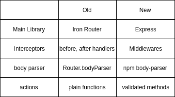

# Documentation

## Table of contents

1. [Features](#features)
2. [Usage with Meteor](#usage)
3. [Add route handlers](#add-route-handlers)
4. [Add request/response schema](#add-request/response-schema)
5. [Add middlewares](#add-middlewares)

## Features
The goal is to develop extendable REST API package.

1. Use Express to handle rest requests in Meteor app
2. Define API versions: v1, v2
3. Use Meteor method to handle requests
4. Configure request/response schema
5. Configure route middlewares


## Usage

You need to add RestApp to the WebApp and then you will be able to handle requests by Express within Meteor:
```js
import { WebApp } from "meteor/webapp";
import { RestApp, RestConfig } from "@mdn/rest";

WebApp.connectHandlers.use(RestApp);
```

And then build your router: 
```js
RestConfig.buildRouter("v1", "/api");
```

## Add route handlers

To add route handler you need to run `addValidatedMethod` method in `RestConfig` instance:

```js
import { getNotesMethod } from "./methods";

RestConfig.addValidatedMethod(getNotesMethod, {
  routerId: "v1",
  method: "GET",
  path: "/notes"
});
```

if you go to `GET /api/notes`, rest will run `getNotesMethod` and return it's result.

### Method body
By default router will pass `request.body` to the validated method, but if you need reconfigure it to other field, provide `bodySrc` option:

```js
RestConfig.addValidatedMethod(getNoteMethod, {
  routerId: "v1",
  method: "GET",
  path: "/notes/:_id",
  request: {
    bodySrc: "params"
  }
});
```


## Add request/response schema

Request/Response Schemas are defined by `ajv` package:

```js
RestConfig.addValidatedMethod(getNoteMethod, {
  routerId: "v1",
  method: "GET",
  path: "/notes/:_id",
  request: {
    bodySrc: "params",
    schema: {
      ...schema...
    }
  },
  response: {
    schema: {
      ...schema...
    }
  }
});
```

## Add middlewares

You can also add endpoint middlewares, which can resolve with context data. Context data then will by passed to Meteor method. This is usefull if you want to develop own authorization methods: jwt, saml, etc...

Sample auth middleware

```js
function authMiddleware(req, res) {
  return new Promise((resolve, reject) => {
    const user = fakeAuth(req.headers);

    resolve({
      authUser: user,
      userId: user._id
    });
  });
}
```

After middleware is developed you need to register it in RestConfig:

```js
RestConfig.addMiddleware("test", authMiddleware);
```

Use this middleware:
```js
RestConfig.config({
  routerId: "v1",
  route: "/notes/:_id",
  method: "get",
  middleware: "authMiddleware"
});
```

The data resolved by middleware will be provided to the `this` of the method:
```js
export const getNoteMethod = new ValidatedMethod({
  name: "notes.methods.getOne",

  // validate: function() {},
  validate: new SimpleSchema({
    _id: String
  }).validator(),

  run(filter) {
    console.log(this) // will print { authUser: Object, userId: "userId" }
  }
});
```

## QA

### What were we using before Express?

REST API was implemented using [iron-router](https://github.com/iron-meteor/iron-router) package. It's great but outdated and not maintained anymore (last commit 3 years ago).
It may have security/optimization/new meteor compatibility issues because it's outdated.

### What did we remove?
We have removed Iron-Router, it's dependencies and related libraries: iron body parser. We will use Express and it's related dependencies instead. 

### How Using express helps in the REST package? what was there before?

MeteorJS does not have a good library for REST, Meteor WebApp can be used only to define middlewares. Current REST packages are really outdated (Picker, Iron router, etc...). So we integrated Express into Meteor to implement REST.

### Implementations comparison.




### Workflow from the REST API package perspective
```
User Request -> Meteor WebApp -> Express -> Express Router -> Meteor methods 
```